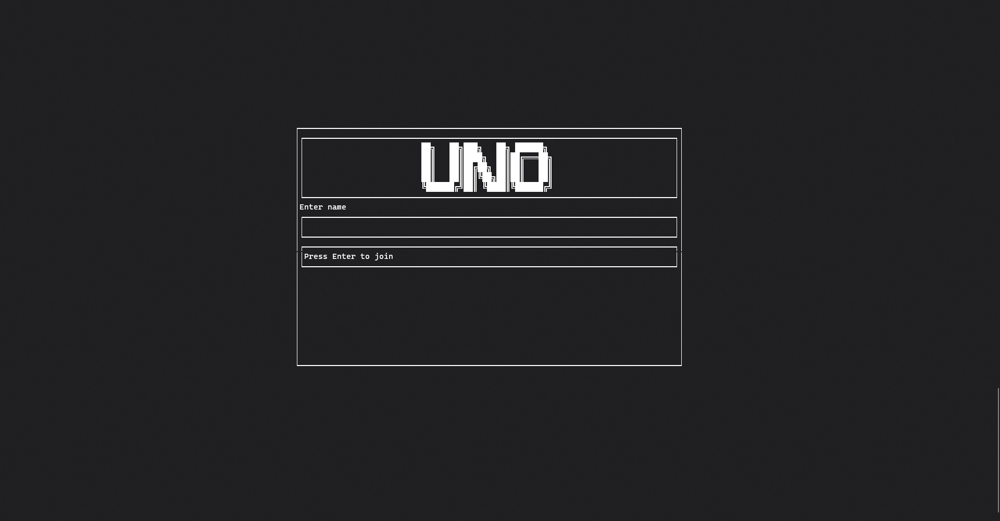
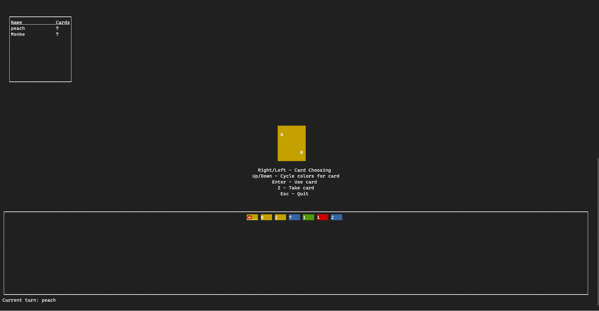

# minesweeper-tui
A little project that implements the game uno based on a TUI using rust.

## Compilation
To run on your machine simply do the following (Using release is recommended as it's faster): 

**NOTE: It's based on crossterm backend so it should work both on linux and on windows terminal emulators with UTF-8 support.**

To host:
```bash
cargo run --release -- -s
```

To join:
```bash
cargo run --release
```

## Demo
Joining screen:


Game screen:
